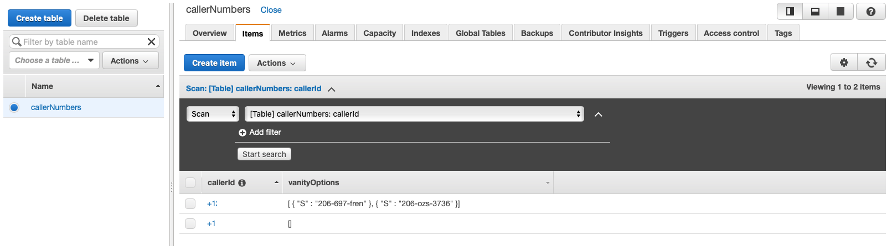
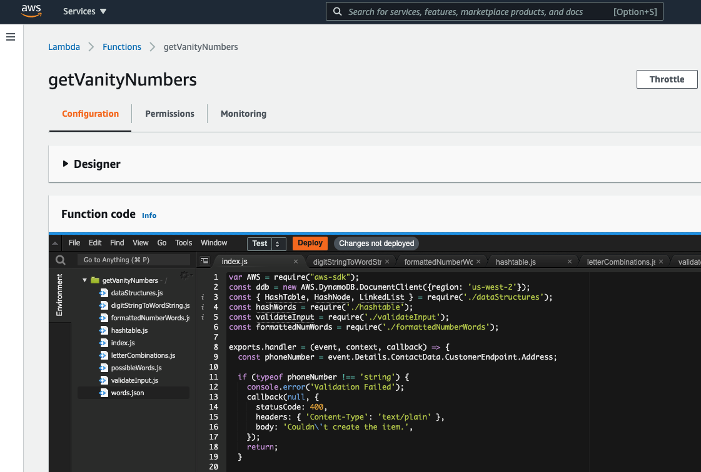

# Voice Foundry Vanity Phone Number Application

### Author: Jonny Graybill

# Application Information
* This application utilizes three popular Amazon Web Services to perform a calculation based on a user's phone number. Once initialized, the algorithm takes a phone number string as an input, and outputs a string of potential vanity numbers that could be used.
* AWS Services:
  * Amazon Connect
  * Lambda
  * DynamoDB

## Problem Domain
1.	Create a Lambda that converts phone numbers to vanity numbers and save the best 5 resulting vanity numbers and the caller's number in a DynamoDB table. "Best" is defined as you see fit - explain your thoughts.

2.	Create an Amazon Connect contact flow that looks at the caller's phone number and says the 3 vanity possibilities that come back from the Lambda function.

## About Vanity Numbers
* What is a vanity phone number?

  * As per [line2.com](https://www.line2.com/articles/should-you-get-a-vanity-phone-number-for-your-business/), a vanity phone number is a custom-made set of digits that either spell out a word or are memorable in some way. For example, a building company may use 1-800-BUILDER (1-800-284-5337) as their business number, where the letters are spelled out using the numbers on the telephone keypad.

* Why would someone want a vanity phone number?

  * According to [Adeptel](http://www.adeptel.com/vanity.asp), the marketing potential of an organization expands rapidly when using a vanity toll-free number. Sales increase, customer service improves, and because of the heightened brand recognition, your customers know who you are and how to contact you. Marketing efforts can seem almost effortless or become more focused in new product areas or markets.

### Initial Input Thoughts
| Inputs         | Outputs       |
| ---------------|:-------------:|
| 2061234567     | 2061234567    |
| 206-123-4567   | 2061234567    |
| 206 123 4567   | 2061234567    |
| (206) 123 4567 | 2061234567    |
| (206) 123-4567 | 2061234567    |
| (206)-123-4567 | 2061234567    |

* This is how I initially thought about how a phone number input would go into the algorithm and be normalized for output.

## Approach/Implemented Solution Reasoning
Why I implemented the solution the way I did:

* This project as a whole felt like a unique take on a practical business need. Typically when I would think about vanity numbers, it was more along the lines of a business looking for the perfect phone number that they could purchase and use. I like the 1-800-BUILDER example - if you have a construction business and you're getting set up with a phone number, being able to search through available options and find something practical like 1-800-BUILDER, is ideal.

* However, if you already have your phone number set in stone and can't change it, being able to calculate different ways you could potentially market the number you have, could be quite helpful. With this in mind, I knew a few things about this project would be simplified because essentially there a very limited margin for different inputs. The drawback to this is that many of the vanity options won't be very applicable for a caller, or there may be no vanity options available (like in the case of my own personal phone number).

* One thing I was initially worried about was the whole aspect of defining vanity numbers. It seems that full 7-letter words are a bit of a rarity - most phone numbers won't be able to make that kind of combination. In addition, there can be so many different ways a number can be considered vanity:

  * If the number 1-800-356-9377 can return 1-800-FLOWERS, should it also return 1-800-FLOW-377?

  * I struggled with this for a while before finally deciding that due to time constraints and project scope, I would only calculate three different options:

    1. Seven-digit words that could come from the full 7 digits of a number.

    2. Three-digit words that could be taken from the first 3 digits of a number

    3. Four-digit words that could be taken from the last 4 digits of a number.

  * This means that 1-800-356-9377 could return 1-800-FLOWERS, but it would not return any other words, as no 3-digit words can be made from the "356" chunk of the number, and no 4-digit words can be made from the "9377" chunk of the number.

* With all of these variables considered, I decided that when the Lambda returned the top 5 vanity number options for the database, I would rank them in "best" order 1-5 based on how long the word was. If I could get a full 7-digit valid word back, those would be top priority. If I got some valid 4-digit words, those would be next on my priority list. Any valid 3-digit words that got returned would be lowest priority. Within these three categories, I would just rank them alphabetically, as any other sub-ranking system was likely going to be out of scope for the project.

* When I first started thinking about how to approach this project, my mind went to potentially working out a recursive solution. Recursive algorithms aren't my strong-suit, but I knew from past experiences that they were often a viable way to go about use cases like this.

* Realistically, performance was always going to be a driving factor in a project like this. Calculating thousands of different possibilities depending on the input you get means that you need to be concerned with speed. In addition, hosting the code in a Lambda further advanced the need for a performant algorithm.

* After I got the recursive solution working, it became clear that I needed to look in a different direction. The algorithm took around 30 seconds from start to finish in my local NodeJS environment, and an entire minute to run in a browser-based repl.it. Neither of those things were going to be fast enough to be considered for a Lambda.

* Needing to do some serious refactoring, I opted first to try and rebuild my solution in an iterative way. This was much easier than I expected, as I'd already thought-out the logic for it when building the recursive approach I tried first.

* The algorithm was definitely faster - but only by about 5 seconds. I was headed in the right direction, but it wasn't enough. To try and isolate what was taking the longest amount of time, inputting temporary timestamps was effective, as well as some of Google Chrome's built-in developer tools. The realization came to me, that the section where I checked the lengthy array of words (mostly gibberish letter combinations) was taking the bulk of the runtime. Initially, I looked around for the best way to check if a letter combination was a valid word or not, and many solutions involved APIs that were way too overengineered for what I needed. I found an NPM module called "check-words" that I had been using from the beginning. It simple checks a string to see if it is a valid word, and returns a boolean. This however, was the culprit for my long runtimes.

* After much more googling than I anticipated, it seemed the fastest option would be to find a resource file that had all the English Dictionary words, and then create a hashmap of it.

* This wasn't nearly as difficult as I thought it would be. My hashmap solution implements individual nodes via a Linked List, as I was trying to prioritize speed.

* The order I went about building this project definitely played a part in what the end product looks like. I started with local NodeJS dveelopment of the algorithm, as I knew it would be the backbone of the whole project. After I was decently happy with that and all my JEST tests, I moved on to getting the algorithm into Lambda, and connecting it with DynamoDB. Once I was able to successfully do this, I was finally able to move on to building my Amazon Connect contact flow, and linking it with my Lambda.

## Struggles
What I struggled with the most during this project:

* It had been a long time since I used Lambda and DynamoDB, and this use case was very different than how I'd used them before. This meant I had to get significantly involved with the AWS documentation, which can be notoriously challenging to navigate.

* I struggled for a bit at the beginning getting my AWS account squared away. I had other resources in it that needed to be cleared out before I could start working in earnest on building this app.

* Error handling with Amazon Connect was surprisingly difficult. Most of the documentation I found on the subject wasn't as helpful as I had expected, requiring a lot of things to be done via trial-and-error.

* Most phone numbers I had the ability to test with didn't return very desirable results, making progress slower.

## Problems Encountered
What interesting problems I encountered during this project:

* In the beginning of my Amazon Connect contact flow development, the program would abrubtly end while invoking my Lambda. Because I had to rewrite several of my usual error handling, it was difficult for me to determine if the Lambda was timing out because it took too long, or if there was a more serious error that wasn't getting displayed for me.

* For some odd reason, initially, when the Lambda was looking at DynamoDB records, it would end unexpectedly if it encountered records that already existed in the table. It was odd to me, as the DynamoDB "PUT" method I was using was supposed to have case-handling built in for when that happens.

* It was a bit of a unique process figuring out how to format the Lambda response so that the output was different for the database than what the connect flow would receive. When the connect flow reads out the vanity options to the caller, I wanted it to say the actual digits "two zero six" instead of "two hundred six." It read the string values as actual full number values. However this isn't particularly what I wanted to see in the database. In hindsight, I may not have needed to format the response to the connect flow like this. Perhaps just putting spaces in between the digits would have worked the same way. But at that point, I wanted to be absolutely sure.

* It took me a little bit to figure out that the Amazon Connect flow could only parse a Lambda response if it was formatted in a specific way. Things have to come back as a flat object essentially, which is different than how I had planned and initially implemented my Lambda returns.

## Shortcuts Taken
What shortcuts I took for the sake of time that I wouldn't have done for production:

* 1-800-FLOWERS not also being able to output 1-800-FLOW-377 - while this could be considered a shortcut, I felt it was necessary with the time and resource constraints.

* Phone number validation - country code at the first of the number. I was running low on time, and as a result just formatted my export handler to deal with the +1 U.S. country code.

* I pretty much just exported out each helper function to other files in the Lambda. With more time, and more regard for production lifecycle, I would have tried to streamline the functions a bit more to ensure that there wasn't any overlapping work. At times I felt my solution was a bit overengineered, so there is definitely room for cleaner production code.

* More robust testing within Lambda. While I did plenty of testing in my local NodeJS environment with JEST, those tests didn't necessarily translate over to Lambda. I ended up having only minimal Lambda tests to work with, as there was a lot of time left for learning how to create robust Lambda tests, when I reached that point in the project.

* AWS IAM permission roles. In a production environment, you want to limit the permissions of a user as much as possible. For development, it was fine - but best practices typically say you should only give the bare minimum necessary.

## Desired Features
What I would have liked to implement if I had more time to work on this project:

* A full and comprehensive solution for being able to implement different word combinations - I.E. 1-800-FLOWERS also being able to return 1-800-FLOW-377.

* Taking additional user data into account - such as asking at the beginning of the call if the user would prefer longer or shorter vanity numbers, and then rank their results accordingly.

* More complete phone number input validation - particularly for callers with varying country codes.

## Components
#### index.js
#### validateInput.js
#### letterCombinations.js
#### hashtable.js
#### possibleWords.js
#### formattedNumberWords.js
#### digitStringToWordString.js
#### dataStructures.js
#### test.js
#### lambdaTest.json
#### words.json

#### Running the app
1. Call the designated Amazon Connect phone number for this application
2. Enjoy hearing Joey - one of Amazon Connect's automated voices, tell you which vanity phone number options are able to be associated with your phone number

## Links, Tutorials, and Resources
### Vanity Number Informational
  * [What is a vanity phone number?](https://www.line2.com/articles/should-you-get-a-vanity-phone-number-for-your-business/)
  * [Why would you want a vanity phone number?](http://www.adeptel.com/vanity.asp)
  * [Algorithm inspiration](https://phonespell.org/phonespell.html)

### Lambda
  * [Invoke Lambda functions](https://docs.aws.amazon.com/lambda/latest/dg/API_Invoke.html)
  * [Make Lambda functions faster](https://www.webiny.com/blog/5-tips-to-make-your-lambda-functions-run-faster-and-cheaper)
  * [Automating error handling](https://aws.amazon.com/blogs/compute/automating-aws-lambda-function-error-handling-with-aws-step-functions/)
  * [Best practices for working with Lambda](https://docs.aws.amazon.com/lambda/latest/dg/best-practices.html)
  * [Using NPM modules with Lambda](https://stackoverflow.com/questions/34437900/how-to-load-npm-modules-in-aws-lambda#:~:text=37-,A%20.,%2C%20committing%20to%20git%2C%20etc)

### DynamoDB
  * [CRUD functions with DynamoDB](https://docs.aws.amazon.com/amazondynamodb/latest/developerguide/GettingStarted.NodeJs.03.html)
  * [PutItem Command](https://docs.aws.amazon.com/amazondynamodb/latest/APIReference/API_PutItem.html)

### Amazon Connect
  * [Create dynamic, personalized experiences](https://aws.amazon.com/blogs/contact-center/creating-dynamic-personalized-experiences-in-amazon-connect/)
  * [Voice speed options](https://docs.aws.amazon.com/polly/latest/dg/voice-speed-vip.html)
  * [Creating instance](https://www.youtube.com/watch?v=oZCIogaOYeo&list=PL4SEtvjUqihF_n-OjIsHwqqayTsAToBOx&index=5)

### Algorithm
  * [NPM module check-word](https://www.npmjs.com/package/check-word)

### Dictionary
  * [English words in JSON](https://github.com/dwyl/english-words)

### NodeJS
  * [Nodejs downloads](https://nodejs.org/en/)

### Sample

