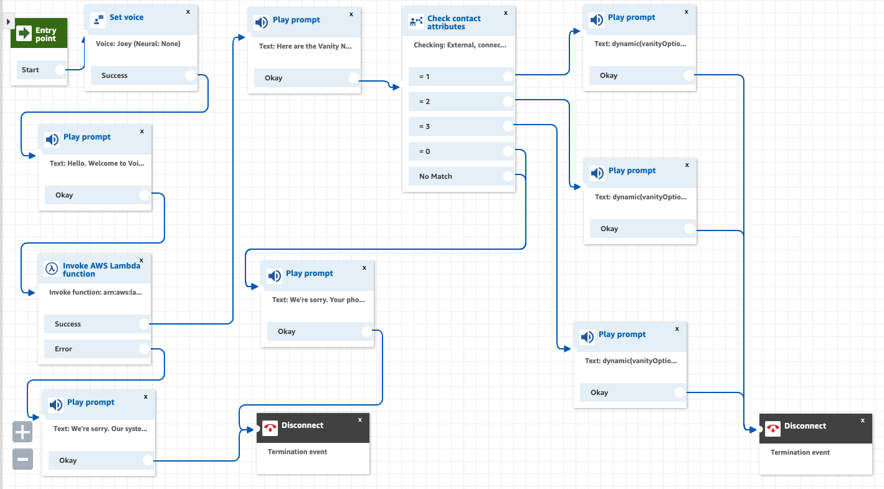

# Voice Foundry Vanity Phone Number Application

### Author: Jonny Graybill

# Application Information
* This application utilizes three popular Amazon Web Services to perform a calculation based on a user's phone number. Once initialized, the algorithm takes a phone number string as an input, and outputs a string of potential vanity numbers that could be used.
* AWS Services:
  * Amazon Connect
  * Lambda
  * DynamoDB

## Problem Domain
1.	Create a Lambda that converts phone numbers to vanity numbers and save the best 5 resulting vanity numbers and the caller's number in a DynamoDB table. "Best" is defined as you see fit - explain your thoughts.
2.	Create an Amazon Connect contact flow that looks at the caller's phone number and says the 3 vanity possibilities that come back from the Lambda function.

## About Vanity Numbers
* What is a vanity phone number?
  * As per [line2.com](https://www.line2.com/articles/should-you-get-a-vanity-phone-number-for-your-business/), a vanity phone number is a custom-made set of digits that either spell out a word or are memorable in some way. For example, a building company may use 1-800-BUILDER (1-800-284-5337) as their business number, where the letters are spelled out using the numbers on the telephone keypad.

* Why would someone want a vanity phone number?
  * According to [Adeptel](http://www.adeptel.com/vanity.asp), the marketing potential of an organization expands rapidly when using a vanity toll-free number. Sales increase, customer service improves, and because of the heightened brand recognition, your customers know who you are and how to contact you. Marketing efforts can seem almost effortless or become more focused in new product areas or markets.

### Initial Input Thoughts
| Inputs         | Outputs       |
| ---------------|:-------------:|
| 2061234567     | 2061234567    |
| 206-123-4567   | 2061234567    |
| 206 123 4567   | 2061234567    |
| (206) 123 4567 | 2061234567    |
| (206) 123-4567 | 2061234567    |
| (206)-123-4567 | 2061234567    |
* This is how I initially thought about how a phone number input would go into the algorithm and be normalized for output.

# Aproach
* Outline

## Implemented Solution Reasoning
* Why I implemented the solution the way I did.

## Struggles
* What I struggled with during this project.

## Problems Encountered
* What interesting problems I encountered during this project.

## Shortcuts Taken
* What shortcuts I took for the sake of time that I wouldn't have done for production.

## Desired Features
* What I would have liked to implement if I had more time to work on this project.

## Components
### index.js

### Helpers
  #### validateInput.js
  #### letterCombinations.js
  #### hashtable.js
  #### possibleWords.js
  #### formattedNumberWords.js
  #### digitStringToWordString.js

### Data Structures
  #### dataStructures.js

### Testing
  #### test.js
  #### lambdaTest.json

### Assets
  #### words.json

#### Running the app
1. Call the designated Amazon Connect phone number for this application
2. Enjoy hearing Joey - one of Amazon Connect's automated voices, tell you which vanity phone number options are able to be associated with your phone number

## Links, Tutorials, and Resources
### Vanity Number Informational
  * [What is a vanity phone number?](https://www.line2.com/articles/should-you-get-a-vanity-phone-number-for-your-business/)
  * [Why would you want a vanity phone number?](http://www.adeptel.com/vanity.asp)
  * [Algorithm inspiration](https://phonespell.org/phonespell.html)

### Lambda
  * [Invoke Lambda functions](https://docs.aws.amazon.com/lambda/latest/dg/API_Invoke.html)
  * [Make Lambda functions faster](https://www.webiny.com/blog/5-tips-to-make-your-lambda-functions-run-faster-and-cheaper)
  * [Automating error handling](https://aws.amazon.com/blogs/compute/automating-aws-lambda-function-error-handling-with-aws-step-functions/)
  * [Best practices for working with Lambda](https://docs.aws.amazon.com/lambda/latest/dg/best-practices.html)
  * [Using NPM modules with Lambda](https://stackoverflow.com/questions/34437900/how-to-load-npm-modules-in-aws-lambda#:~:text=37-,A%20.,%2C%20committing%20to%20git%2C%20etc)

### DynamoDB
  * [CRUD functions with DynamoDB](https://docs.aws.amazon.com/amazondynamodb/latest/developerguide/GettingStarted.NodeJs.03.html)
  * [PutItem Command](https://docs.aws.amazon.com/amazondynamodb/latest/APIReference/API_PutItem.html)

### Amazon Connect
  * [Create dynamic, personalized experiences](https://aws.amazon.com/blogs/contact-center/creating-dynamic-personalized-experiences-in-amazon-connect/)
  * [Voice speed options](https://docs.aws.amazon.com/polly/latest/dg/voice-speed-vip.html)
  * [Creating instance](https://www.youtube.com/watch?v=oZCIogaOYeo&list=PL4SEtvjUqihF_n-OjIsHwqqayTsAToBOx&index=5)

### Algorithm
  * [NPM module check-word](https://www.npmjs.com/package/check-word)

### Dictionary
  * [English words in JSON](https://github.com/dwyl/english-words)

### Testing
  * lambda
  * amazon connect
  * dynamodb
  * jest

### NodeJS
  * [Nodejs downloads](https://nodejs.org/en/)

### Sample

